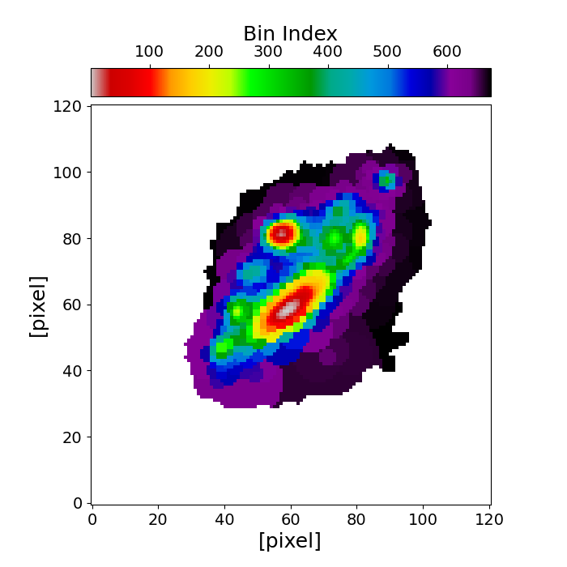

# piXedfit-dense_basis

Spatially resolved SED analysis with JWST and HST imaging data using the [**piXedfit**](https://pixedfit.readthedocs.io/en/latest/) and [**Dense Basis**](https://dense-basis.readthedocs.io/en/latest/). Image processing and pixel binning are carried out with **piXedfit** and fitting to the spatially resolved SEDs are performed with **Dense Basis**.

## Imaging data
* JWST NIRCam images from GO 2282 (PI Coe)
* HST ACS images from RELICS GO 14096 (PI Coe)

## Analysis flow
* Step1_image_processing.ipynb
* Step2_pixel_binning.ipynb
* Step3_Fitting_spatially_resolved_SEDs_with_dense_basis.ipynb

